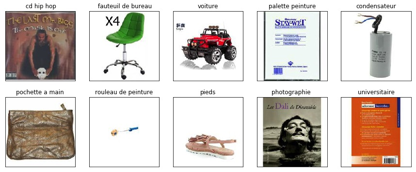

Solution for [Cdiscount’s Image Classification Challenge](https://www.kaggle.com/c/cdiscount-image-classification-challenge) on Kaggle (37th place, top 6%). I used PyTorch to finetune pretrained ResNet-152 and Inception-ResNet-v2 models.

### Competition
The goal of the competition is to classify products into 5270 classes. The train set contains more than 12 million images (however only about 7.7 million images were unique, see [prepare_data.py](prepare_data.py) file which is used to remove duplicates from the train data). The test set contains about 1.7 million images. Each image has resolution 180x180.

Here are some example images and their corresponding labels (label text is in French):



### My solution
I used PyTorch to finetune pretrained ResNet-152 from [torch-vision lib](https://github.com/pytorch/vision) and pretrained Inception-ResNet-v2 
from [Pretrained models for Pytorch lib](https://github.com/Cadene/pretrained-models.pytorch).
I trained only those two models, but my code also allows to finetune any ResNet, DenseNet or ResNeXt model.


### Directory structure
The code expects the following directory structure:

```
input/
├── category_names.csv
├── sample_submission.csv
├── test.bson
└── train.bson
code/
├── pretrainedmodels
├── __init__.py
├── augmentation_transforms.py
├── config.py
└── ...
pickled_data/
└── ...
predictions/
└── ...
saved_models/
└── ...
submissions/
└── ...
```

### Requirements
- Python 3.6
- PyTorch 0.3
- Crayon server
- Libraries from requirements.txt

### To run the code
- Adjust config variables in config.py
- Execute run.sh file
